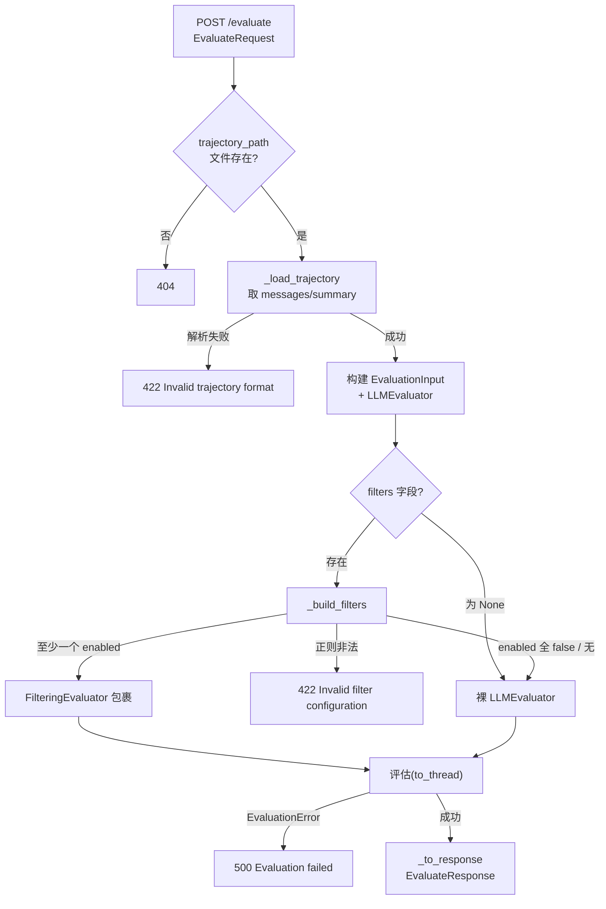

# POST /evaluate — 测试需求串讲

> 本串讲只针对对外暴露的 `POST /evaluate` 同步轨迹评估接口，用于和测试对齐“测什么、怎么判、边界在哪”。所有字段语义以路由实现 `src/evo_agent/api/routes/evaluate.py` 为准。

## 1. 背景与目标

### 背景

- 当前问题：评估能力此前没有统一对外入口，调用方需要自己拼装 `LLMEvaluator`、`FilteringEvaluator`、轨迹加载等逻辑，集成成本高且容易拼错（如漏传 `skill_names`、过滤器配置不规范）。
- 影响范围：所有需要评估一条 Agent 会话轨迹的下游（优化 Pipeline、平台评估、人工复核）。
- 需求来源：平台模板驱动 API（ADR-0005），评估需要作为可独立调用的原子能力暴露。

### 目标

- 目标 1：对外提供同步 `POST /evaluate` 接口，单条轨迹输入，返回结构化评估结果。
- 目标 2：支持可选的确定性过滤层（工具失败 / 用户反馈），匹配坏例短路返回零分，不命中再走 LLM。
- 目标 3：用 HTTP 状态码清晰区分 4 类错误：轨迹不存在 / 请求非法 / 过滤配置非法 / LLM 评估失败。

### 非目标

- 非目标 1：本接口不负责批量评估（`batch_evaluate` 由内部 Pipeline 编排，不在此暴露）。
- 非目标 2：不负责评估结果的持久化、入库和查询。
- 非目标 3：不负责并发限流、租户隔离和鉴权（由网关层处理）。

## 2. 场景、规则与约束

### 核心场景

| 场景 | 触发条件 | 预期结果 |
|---|---|---|
| 仅 LLM 评估 | 不传 `filters`，或传了但 `enabled` 全为 false | 走 `LLMEvaluator`，返回 `status="evaluated"`、带 `score` 和 `is_pass` |
| 过滤短路命中坏例 | 传 `filters` 且某 filter 命中 | 不调用 LLM，返回 `status="filtered"`、`score=0.0`、`is_pass=false`、`filter_matches` 非空 |
| 过滤未命中转 LLM | 传 `filters` 但无 filter 命中 | 走 `LLMEvaluator`，正常返回 `status="evaluated"` |
| 轨迹文件不存在 | `trajectory_path` 指向文件不存在 | 返回 `404` |
| 请求体非法 | 缺必填字段 / 轨迹 JSON 损坏 / 正则非法 | 返回 `422` |
| LLM 评估失败 | LLM 调用异常或 `EvaluationError` | 返回 `500` |

### 关键规则

| 规则 | 说明 |
|---|---|
| 过滤在 LLM 之前 | `FilteringEvaluator` 在委托给 `LLMEvaluator` 之前确定性检查轨迹；命中即短路，绝不调用 LLM |
| `filters` 字段整体为可选 | 不传 `filters` 字段 → 直接用裸 `LLMEvaluator`，不过滤；传了字段但 `enabled` 全为 false → 同样走裸 `LLMEvaluator` |
| 用 `status` 而非 `score` 判定过滤 | 正常评估也可能得 0 分，前端/调用方必须用 `status === "filtered"` 判断是否为过滤结果 |
| `is_pass` 来源 | evaluated 时由 LLM 输出给出；filtered 时恒为 `false` |
| `attributed_skill` 必须在已知列表 | LLM 归因的 skill 若不在请求 `skill_names` 中，会被 `LLMEvaluator` 判为非法并抛 `EvaluationError` → 500 |
| 轨迹只取已知字段 | `_load_trajectory` 仅读取 `messages`、`summary`，轨迹文件中未知字段不会触发 `extra="forbid"` 报错 |

### 关键约束

| 约束 | 说明 | 影响 |
|---|---|---|
| 同步阻塞 | 评估在 `asyncio.to_thread` 中同步执行，一次请求一次评估 | LLM 耗时长时该请求会长时间占用线程，超时由调用方/网关控制 |
| `skill_names` 必填且非空 | `EvaluationInput` 强制要求非空列表，且用于归因校验 | 漏传 → 422；归因不在列表 → 500 |
| 路径为服务器本地路径 | `trajectory_path` 是服务端文件系统路径，非客户端可访问 URL | 测试需先把轨迹文件落到临时目录再传路径 |
| LLM 配置每次必传 | `LLMConfig` 的 `model_name`/`api_key`/`api_base` 必填，无全局默认 | 缺任一 → 422 |
| 默认过滤规则内置 | `enabled=true` 且未 `replace_default_patterns` 时，默认正则自动生效 | 测试默认规则命中需使用内置关键词 |

### 待确认点

| 问题 | 影响 | 当前处理 |
|---|---|---|
| `client_provider` 默认值与文档不一致（代码 `OpenAI`，旧文档 `DashScope`） | 影响未显式传 `client_provider` 的调用方连通性 | 以代码实现为准，串讲按 `OpenAI` 记录，需与上游确认是否要改默认值 |
| 是否需要请求级超时/取消 | 长时间 LLM 调用会占满线程 | 本接口暂不实现，由网关层处理 |

## 3. 总体方案

### 方案概述

1. 入口：`POST /evaluate`，请求体 `EvaluateRequest`。
2. 核心处理在路由 `evaluate_trajectory` 中：加载轨迹 → 构建 `EvaluationInput` → 按 `filters` 决定用裸 `LLMEvaluator` 还是 `FilteringEvaluator` 包裹。
3. 数据从服务端轨迹文件读取（JSON），评估结果在内存中转换为 `EvaluateResponse`。
4. 通过 HTTP 状态码 + `EvaluateResponse.status` 对调用方生效。

### 链路图 / 流程图

### 模块分工

| 模块 | 职责 | 输入 | 输出 |
|---|---|---|---|
| `evaluate.py` 路由 | 参数校验、轨迹加载、评估器组装、结果转换 | `EvaluateRequest` | `EvaluateResponse` / `HTTPException` |
| `_load_trajectory` | 从 JSON 文件构造 `StandardTrajectory`（仅取 `messages`/`summary`） | `Path` | `StandardTrajectory` |
| `_build_filters` | 把 `FilterConfig` 转成 `TrajectoryFilter` 实例列表（仅 enabled 的） | `FilterConfig` | `list[TrajectoryFilter]` |
| `_to_response` | 领域 `EvaluationResult` → API `EvaluateResponse` | `EvaluationResult` | `EvaluateResponse` |
| `LLMEvaluator` | 调用 LLM 评分 + 解析 + 归因校验 | `EvaluationInput` | `EvaluationResult` |
| `FilteringEvaluator` | LLM 前确定性过滤，命中短路 | `EvaluationInput` | `EvaluationResult`（filtered 或委托） |

## 4. 关键设计

| 设计点 | 处理方式 | 异常/边界 |
|---|---|---|
| 过滤层包裹策略 | 有 `filters` 字段且 `_build_filters` 非空才用 `FilteringEvaluator` 包裹；否则裸 `LLMEvaluator` | `filters` 存在但无 enabled → 退化为裸 LLM，不报错 |
| 轨迹容错加载 | 只取 `messages`、`summary`，绕开 `StandardTrajectory` 的 `extra="forbid"` | 文件含未知字段仍可加载；JSON 损坏 → 422 |
| 过滤器构造容错 | `_build_filters` 包在 try/except 中 | 非法正则 → 422 `Invalid filter configuration`，不泄漏为 500 |
| 评估异常分级 | 文件不存在 404；格式/配置非法 422；评估执行期 `EvaluationError` 500 | LLM 超时、解析失败、归因非法都归一为 `EvaluationError` → 500 |
| 同步评估异步化 | `evaluator.evaluate_input` 用 `asyncio.to_thread` 执行，避免阻塞事件循环 | — |

### 接口说明

| 接口/调用 | 类型 | 调用方 | 入参要点 | 字段约束/默认值 | 出参/事件 | 错误或异常 |
|---|---|---|---|---|---|---|
| `POST /evaluate` | HTTP | 平台 / Pipeline / 人工 | `trajectory_path`、`prompt_template`、`llm_config`、`skill_names` 必填；`expected_result`、`filters` 可选 | `client_provider` 默认 `OpenAI`；`temperature` 0.1；`max_tokens` 2048；`verify_ssl` false；filter `enabled` 默认 false | `EvaluateResponse`（`status`/`score`/`is_pass`/`per_metric`/`reason`/`attributed_skill`/`filter_matches`） | 404 文件不存在；422 请求/轨迹/过滤配置非法；500 评估失败 |

### 配置说明

本接口无独立配置项，所有配置随请求体传入。仅记录运行时固定默认值：

| 配置项 | 所在位置 | 默认值 | 生效时机 | 影响范围 | 回滚/关闭方式 |
|---|---|---|---|---|---|
| `client_provider` | `LLMConfig` | `OpenAI` | 每次请求 | 模型服务商选择 | 调用方显式传值 |
| `temperature` | `LLMConfig` | `0.1` | 每次请求 | LLM 采样 | 调用方显式传值 |
| `max_tokens` | `LLMConfig` | `2048` | 每次请求 | LLM 最大输出 | 调用方显式传值 |
| `skip_initial_user_messages` | `UserFeedbackFilterConfig` | `1` | 启用该 filter 时 | 跳过首条用户消息 | 调用方显式传值 |

## 5. 可观测性

| 观测点 | 日志/指标/状态 | 用途 |
|---|---|---|
| HTTP 状态码 | 接口返回 404/422/500 | 快速区分错误类型 |
| 响应 `status` 字段 | `evaluated` / `filtered` | 判断是否走过滤短路，过滤是否误杀 |
| `filter_matches` | 命中的 `rule_id` / `message_index` / `evidence` | 复核过滤命中是否准确，证据是否合理 |
| 评估中间件日志 | `POST {path} body: ...`（app 中间件打印前 2000 字符） | 排查请求体内容、字段缺失 |
| `EvaluationError` 文案 | `detail` 中 `Evaluation failed: ...` | 定位 LLM 调用 / 解析 / 归因校验失败原因 |

## 6. 测试建议

### 建议测试重点与开发自测门禁

| 前置/触发条件 | 建议测试重点 | 希望保证的结果 | 优先级建议 | 建议测试方式 | 是否开发自测门禁 |
|---|---|---|---|---|---|
| 合法请求 + 不过滤 | 仅 LLM 评估链路 | 200，`status=evaluated`，`score`/`is_pass` 正确映射 | P0 | 集成（mock LLMEvaluator） | 是 |
| 传 `filters` 且命中 | 过滤短路 | 200，`status=filtered`，`score=0.0`，`is_pass=false`，`filter_matches` 非空且字段完整 | P0 | 集成（mock LLM） | 是 |
| 传 `filters` 但 `enabled` 全 false | 退化为裸 LLM | 200，走 `LLMEvaluator`（不应实例化 FilteringEvaluator） | P1 | 集成 | 否 |
| `trajectory_path` 文件不存在 | 404 分支 | 404，detail 含 `not found` | P0 | 集成 | 是 |
| 缺 `llm_config` / `skill_names` 等必填 | Pydantic 校验 | 422 | P0 | 集成 | 是 |
| 轨迹 JSON 损坏 | 格式校验 | 422，detail 含 `invalid trajectory format` | P1 | 集成 | 否 |
| 轨迹含未知字段 | `_load_trajectory` 容错 | 200，不因 `extra="forbid"` 报错 | P1 | 集成 | 否 |
| `patterns` 非法正则 | `_build_filters` 容错 | 422，detail 含 `filter configuration` | P1 | 集成 | 否 |
| LLM 抛 `EvaluationError` | 500 分支 | 500，detail 含 `evaluation failed` | P0 | 集成（mock 抛异常） | 是 |
| `filter_matches[].message_index` 正确性 | 过滤证据定位 | 索引与轨迹中实际命中消息一致 | P2 | 单测/集成 | 否 |

### 关键异常与边界

- 轨迹文件含未知字段时仍能加载（只取 `messages`/`summary`），不能误报 422。
- `filters` 字段存在但所有 `enabled=false` 时，必须退化为裸 `LLMEvaluator`，不能因「传了 filters 就报错」。
- 非法正则 `patterns` 必须在 `_build_filters` 阶段被捕获为 422，不能泄漏成 500。
- LLM 归因的 `attributed_skill` 不在 `skill_names` 列表中时，应作为 `EvaluationError` → 500（归因校验）。
- 不能用 `score === 0.0` 判断过滤结果：正常评估也可能为 0 分，必须用 `status`。
- `evidence` 文本应被截断到上限（约 500 字符），避免超长 tool 内容撑爆响应。
- 默认过滤规则（`error`/`failure`/`不对` 等）在 `enabled=true` 且未 replace 时自动生效，测试默认命中需用内置关键词。

## 附录：按需补充项

### 补充文档

| 文档 | 用途 | 链接/路径 |
|---|---|---|
| 接口文档 | API 字段、默认值、示例 | `docs/api/evaluate-api.md` |
| 实现源码 | 路由与转换逻辑 | `src/evo_agent/api/routes/evaluate.py` |
| 现有 API 测试 | 请求/响应映射、状态码、错误分支 | `tests/unit/test_api_evaluate.py` |
| 评估器设计 | `LLMEvaluator`/`FilteringEvaluator` 行为 | `src/evo_agent/evaluator/evaluators/` |

### 响应字段权威定义（`EvaluateResponse`）

| 字段 | 类型 | 说明 |
|---|---|---|
| `status` | `"evaluated"` \| `"filtered"` | 评估状态 |
| `score` | `float` | 综合得分 `[0,1]`，filtered 时为 `0.0` |
| `is_pass` | `bool` | 是否通过；filtered 时为 `false` |
| `per_metric` | `object` \| `null` | 各维度得分；filtered 时为 `{"filter_failure": 0.0}` |
| `reason` | `string` | 评估理由（自由文本或 JSON） |
| `attributed_skill` | `string` | 失败根因归因到的 skill 名（未归因为空串） |
| `filter_matches` | `FilterMatchResponse[]` | 过滤命中详情，evaluated 时为空数组 |

> 注：以代码实现为准。旧版 `evaluate-api.md` 中出现的 `skill_attributions`（数组）字段在当前实现中不存在，实际为 `attributed_skill`（单字符串）；`is_pass` 为顶层字段。
