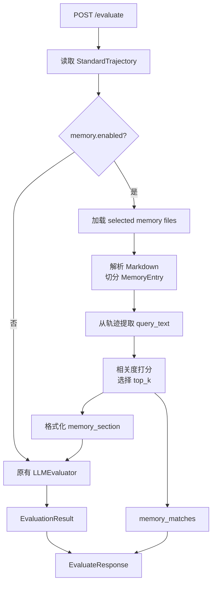

# Evaluator Memory — 需求串讲

> 本串讲面向一个简化版 Evaluator Memory：从 Markdown 记忆文件中动态加载评估经验，并根据当前轨迹做轻量相关度选择，再注入 `LLMEvaluator` prompt。本文用于对齐“做什么、怎么用、边界在哪、怎么测”。

## 1. 背景与目标

### 背景

- 当前 `POST /evaluate` 主要依赖固定评估准则和调用方传入的 `prompt_template`。
- 真实业务轨迹中会逐渐沉淀出一些稳定经验，例如基金推荐要匹配风险偏好、具体推荐要说明理由、用户纠正后必须调整方向。
- 这些经验不适合每次都手工写进 prompt，也暂时不需要复杂向量库或完整规则治理系统。
- 因此需要一个轻量“评估记忆系统”：把历史经验保存为 Markdown，评估时动态选择相关记忆并注入提示词。

### 目标

- 目标 1：支持从本地目录动态加载 Markdown 评估记忆。
- 目标 2：支持每次 `/evaluate` 请求选择候选记忆文件。
- 目标 3：根据当前轨迹做简单相关度打分，自动选出 top-k 记忆条目。
- 目标 4：把选中的记忆格式化后注入 `LLMEvaluator` prompt。
- 目标 5：响应中返回本次加载和命中的 memory 信息，便于排查。

### 非目标

- 非目标 1：不做向量库、embedding、LLM rerank。
- 非目标 2：不做复杂规则适用性判断，不提前判断轨迹是否违反某条记忆。
- 非目标 3：不做规则冲突检测、版本流转、人工审核状态。
- 非目标 4：不让 memory 直接决定分数，最终评分仍由 `LLMEvaluator` 完成。
- 非目标 5：不负责从历史轨迹自动提炼 memory；第一版 memory 文件可人工维护，后续再补提炼脚本。

## 2. 核心概念

### Evaluator Memory

Evaluator Memory 是从历史真实轨迹中总结出的评估经验，形态上是一组 Markdown 文件。

示例目录：

```text
evaluator_memory/
  fund_advisor.md
  customer_service.md
  tool_usage.md
```

示例文件：

```markdown
# fund_advisor

## 风险偏好匹配
tags: 风险偏好, 稳健, 低风险, 基金推荐
dimension: task_completion

当用户表达稳健、低风险、保守等偏好时，推荐结果应匹配该风险偏好。
如果 Agent 推荐明显高风险产品且没有解释原因，应降低 task_completion。

## 推荐理由完整性
tags: 推荐理由, 风险提示, 适用人群, 产品推荐
dimension: trajectory_quality

如果 Agent 给出具体产品推荐，应说明推荐理由、适用人群和主要风险点。
只给产品名称但没有解释依据，应降低 trajectory_quality。
```

### Memory File

一个 Markdown 文件是一组同领域或同主题记忆。例如：

| 文件 | 典型内容 |
|---|---|
| `fund_advisor.md` | 基金推荐、风险偏好、投资建议说明 |
| `customer_service.md` | 客服澄清、用户投诉、售后处理 |
| `tool_usage.md` | 工具调用顺序、工具结果使用、错误恢复 |

### Memory Entry

一个二级标题 `##` 对应一条记忆。每条记忆可以有可选元数据：

| 元数据 | 用途 | 示例 |
|---|---|---|
| `tags` | 相关度打分关键词 | `风险偏好, 稳健, 基金推荐` |
| `dimension` | 影响的评分维度 | `task_completion` |

正文是注入 prompt 的核心内容。

## 3. 总体方案

### 在线评估链路

```text
POST /evaluate
  -> 读取 trajectory
  -> 如果 memory.enabled=true:
       -> 从 memory_dir 加载 selected Markdown 文件
       -> 将 Markdown 切成 Memory Entry
       -> 从当前轨迹提取 query_text
       -> 对每条 entry 做简单相关度打分
       -> 选择 top_k 且 score >= min_score 的 entries
       -> 格式化为 memory_section
  -> 构建 LLMEvaluator prompt
  -> 调用 LLM 评估
  -> 返回 EvaluationResult + memory_matches
```

### 流程图



### 模块分工

建议新增：

```text
src/evo_agent/evaluator/memory/
  __init__.py
  models.py
  loader.py
  retriever.py
  formatter.py
```

| 模块 | 职责 |
|---|---|
| `models.py` | 定义 `MemoryConfig`、`MemoryEntry`、`MemoryMatch`、`MemoryBundle` |
| `loader.py` | 从目录加载 Markdown 文件，做文件名校验、长度限制、mtime 缓存 |
| `retriever.py` | 从轨迹生成 query_text，对 entry 做关键词相关度打分 |
| `formatter.py` | 将命中的 memory entries 格式化为 prompt 片段 |
| `evaluate.py` | 接收请求配置，调用 memory 模块，把结果传给 `LLMEvaluator` |
| `LLMEvaluator` / prompt formatter | 支持注入 `memory_section` |

## 4. 请求与响应设计

### 请求字段

在 `EvaluateRequest` 中新增可选字段 `memory`：

```json
{
  "trajectory_path": "/data/trajectory.json",
  "prompt_template": "...",
  "llm_config": {
    "model_name": "qwen-plus",
    "api_key": "sk-xxx",
    "api_base": "https://example.com/v1"
  },
  "skill_names": ["fund_recommend_skill"],
  "memory": {
    "enabled": true,
    "memory_dir": "/data/evaluator_memory",
    "selected": ["fund_advisor", "tool_usage"],
    "top_k": 3,
    "min_score": 2,
    "max_total_chars": 6000
  }
}
```

字段说明：

| 字段 | 类型 | 必填 | 默认值 | 说明 |
|---|---|:---:|---|---|
| `enabled` | `bool` | 否 | `false` | 是否启用 Evaluator Memory |
| `memory_dir` | `string` | 启用时必填 | 无 | 记忆文件目录 |
| `selected` | `string[]` | 否 | `[]` | 候选记忆文件 ID；空数组表示扫描目录下所有 `.md` |
| `top_k` | `int` | 否 | `3` | 最多注入几条记忆 |
| `min_score` | `int` | 否 | `1` | 相关度低于该分数不注入 |
| `max_total_chars` | `int` | 否 | `6000` | 选中 memory 注入 prompt 前的总字符上限 |

### selected 规则

`selected` 使用不带扩展名的文件 ID：

```json
"selected": ["fund_advisor"]
```

对应文件：

```text
{memory_dir}/fund_advisor.md
```

为避免路径穿越，ID 只允许：

```text
字母、数字、下划线、短横线
```

非法示例：

```text
../secret
fund/advisor
fund_advisor.md
```

### 响应字段

在 `EvaluateResponse` 中新增可选字段：

```json
{
  "memory_matches": [
    {
      "memory_id": "fund_advisor",
      "title": "风险偏好匹配",
      "score": 8,
      "matched_terms": ["稳健", "基金", "风险"],
      "dimension": "task_completion"
    }
  ]
}
```

字段说明：

| 字段 | 类型 | 说明 |
|---|---|---|
| `memory_id` | `string` | 来源记忆文件 ID |
| `title` | `string` | 记忆条目标题 |
| `score` | `int` | 简单相关度分数 |
| `matched_terms` | `string[]` | 命中的关键词或标签 |
| `dimension` | `string \| null` | 该记忆建议影响的评估维度 |

## 5. 相关度选择规则

### query_text 提取

从当前轨迹提取用于相关度计算的文本：

| 来源 | 说明 |
|---|---|
| user 消息 | 用户目标、约束、纠正信号 |
| assistant 最终回答 | 最终结果和关键描述 |
| tool call 名称 | 工具使用场景 |
| trajectory summary | 如果存在，可作为补充 |

第一版不需要 LLM 生成 query，只做确定性拼接和截断。

### 打分公式

建议第一版使用简单可解释打分：

```text
score =
  tags 命中数 * 3
  + 标题关键词命中数 * 2
  + 正文关键词命中数 * 1
  + memory_id 命中加分 * 1
```

命中规则：

- 中文场景可以先用子串包含判断。
- 英文场景统一 lower-case 后按 token 判断。
- 同一个 term 在同一 entry 内多次出现只计一次。
- `matched_terms` 记录命中过的 tag 或关键词，便于排查。

### 选择规则

```text
1. 过滤 score < min_score 的 entry
2. 按 score 降序排序
3. score 相同按 memory_id、title 稳定排序
4. 取前 top_k
5. 如果总字符数超过 max_total_chars，返回 422，不静默截断
```

第一版不做“是否违反 memory”的判断。相关度选择只回答：

```text
哪些历史评估经验与当前轨迹主题相关？
```

是否违反这些经验，由 `LLMEvaluator` 基于完整轨迹判断。

## 6. Prompt 注入设计

### Prompt 片段

注入到 evaluator prompt 的片段建议如下：

```text
## 评估记忆

以下内容是从历史真实轨迹中总结出的评估经验，并根据当前轨迹相关度自动选择。
它们只能作为业务判断参考；当前轨迹事实仍是唯一事实来源。
不要因为某条记忆被选中就直接判定轨迹违规，是否违规需要结合完整轨迹判断。

### 1. 风险偏好匹配
来源：fund_advisor
相关度：8
命中依据：稳健、基金、风险
建议影响维度：task_completion

当用户表达稳健、低风险、保守等偏好时，推荐结果应匹配该风险偏好。
如果 Agent 推荐明显高风险产品且没有解释原因，应降低 task_completion。
```

### 与现有 prompt 的关系

现有 `policy_v1.py` 有 `{diagnostic_rules}`。建议新增独立占位：

```text
{memory_section}
```

如果调用方传入自定义 `prompt_template`：

- 如果模板包含 `{memory_section}`，则替换该占位。
- 如果模板没有 `{memory_section}`，可以把 memory 追加到 `{diagnostic_rules}` 后面或 `messages` 前面。
- 为了避免静默无效，建议日志记录是否成功注入 memory。

## 7. 动态加载策略

### 文件加载

第一版从本地文件系统加载：

```text
memory_dir/{memory_id}.md
```

支持 mtime 缓存：

```text
cache key = absolute_path + mtime
```

文件变更后下一次请求自动重新加载，不需要重启服务。

### 限制

| 限制 | 建议值 | 原因 |
|---|---:|---|
| 单次最多候选文件数 | 20 | 防止误扫大目录 |
| 单文件最大字符数 | 20000 | 防止超大文件拖慢评估 |
| 单次注入条目数 | 3 | 控制 prompt 复杂度 |
| 注入总字符数 | 6000 | 控制 LLM 成本和上下文污染 |
| 文件类型 | `.md` | 简化解析 |

## 8. 异常与边界

| 场景 | 处理 |
|---|---|
| `memory` 不传或 `enabled=false` | 保持现有评估逻辑 |
| `enabled=true` 但 `memory_dir` 为空 | 返回 422 |
| `memory_dir` 不存在 | 返回 422 |
| `selected` 包含非法 ID | 返回 422 |
| 指定 memory 文件不存在 | 返回 422，指出缺失 ID |
| Markdown 文件为空 | 跳过该文件，不报错 |
| 文件存在但没有任何 `##` 条目 | 可把整份文件作为一个 entry，标题用文件名 |
| 相关度全部低于 `min_score` | 不注入 memory，响应 `memory_matches=[]` |
| 命中条目超过 `max_total_chars` | 返回 422，提示调低 `top_k` 或精简 memory |
| memory 加载成功但 LLM 评估失败 | 仍按现有逻辑返回 500 |

## 9. 测试建议

### P0 测试

| 测试点 | 输入 | 预期 |
|---|---|---|
| 未启用 memory | 不传 `memory` | 行为与现有 `/evaluate` 一致 |
| 启用且命中 memory | 轨迹含“稳健”“基金”，selected 包含 `fund_advisor` | prompt 注入“风险偏好匹配”，响应返回 `memory_matches` |
| selected 文件不存在 | `selected=["missing"]` | 422 |
| selected 非法路径 | `selected=["../secret"]` | 422 |
| top_k 生效 | 多条 memory 均命中，`top_k=2` | 只返回 2 条 |
| min_score 生效 | `min_score` 高于所有得分 | 不注入 memory，`memory_matches=[]` |

### P1 测试

| 测试点 | 输入 | 预期 |
|---|---|---|
| 文件修改动态生效 | 第一次请求后修改 `.md` 文件再请求 | 第二次加载新内容 |
| 空 Markdown 文件 | selected 指向空文件 | 跳过，不报错 |
| 无 `##` 条目的文件 | 只有纯文本规则 | 作为单条 entry 加载 |
| 总字符超限 | memory 内容很长且 `max_total_chars` 很小 | 422 |
| 稳定排序 | 多条 score 相同 | 顺序稳定，便于测试 |

## 10. 推荐落地顺序

1. 增加 memory 数据模型和 Markdown loader。
2. 增加简单 retriever，从轨迹文本中计算相关度。
3. 增加 formatter，生成 `memory_section`。
4. 扩展 `LLMEvaluator` prompt formatter 支持 `{memory_section}`。
5. 扩展 `/evaluate` 请求和响应模型。
6. 补充单测和 API 测试。

## 11. 后续可扩展方向

- 增加离线 `MemoryDistiller`，从历史轨迹自动生成 Markdown 记忆。
- 增加 embedding retriever，但保持 `MemoryEntry -> MemoryMatch -> MemoryBundle` 接口不变。
- 增加 memory 分组和权重，例如 `business`、`safety`、`tool_usage`。
- 增加 response 中的 `used_memory`，让 LLM 明确说明实际参考了哪些记忆。
- 增加管理接口，用于查看已加载 memory 和命中统计。

## 附录：最小示例

### 记忆文件

```markdown
# tool_usage

## 工具结果使用
tags: 工具结果, 查询结果, 使用工具, 忽略结果
dimension: trajectory_quality

如果工具返回了关键结果，Agent 后续回答应使用该结果，而不是忽略、编造或重复调用无关工具。
```

### 请求

```json
{
  "trajectory_path": "/data/trajectory.json",
  "prompt_template": "...",
  "llm_config": {
    "model_name": "qwen-plus",
    "api_key": "sk-xxx",
    "api_base": "https://example.com/v1"
  },
  "skill_names": ["search_skill"],
  "memory": {
    "enabled": true,
    "memory_dir": "/data/evaluator_memory",
    "selected": ["tool_usage"],
    "top_k": 2,
    "min_score": 1
  }
}
```

### 注入 prompt

```text
## 评估记忆

以下内容是从历史真实轨迹中总结出的评估经验，并根据当前轨迹相关度自动选择。
它们只能作为业务判断参考；当前轨迹事实仍是唯一事实来源。

### 1. 工具结果使用
来源：tool_usage
相关度：5
命中依据：工具结果、查询结果
建议影响维度：trajectory_quality

如果工具返回了关键结果，Agent 后续回答应使用该结果，而不是忽略、编造或重复调用无关工具。
```
