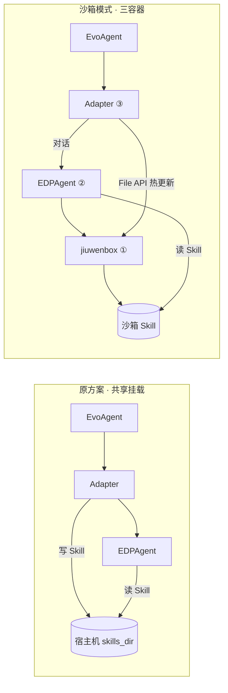
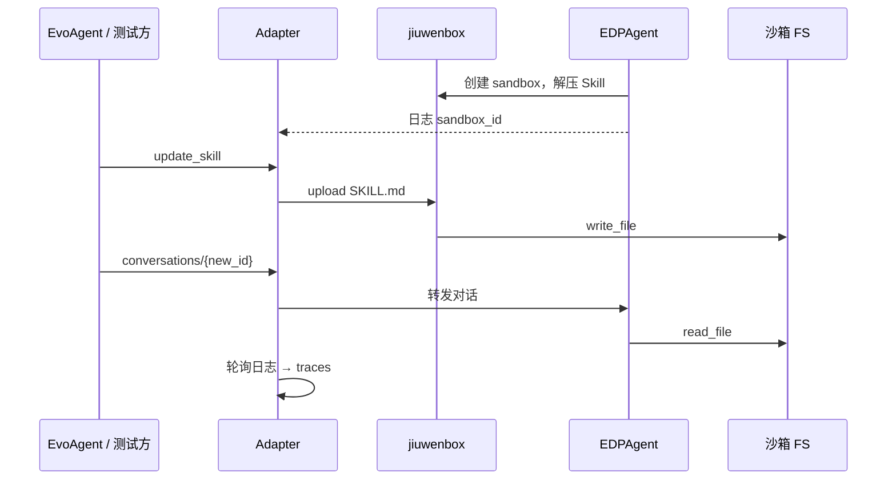

# 沙箱模式开发串讲文档

> **目标对象**：EvoAgentAdapter + EDPAgent（sandbox）+ jiuwenbox  
> **可选对接**：EvoAgent；HTTP API 契约不变。  
> **延伸阅读**：§7；图示见 [`jiuwenbox运行原理与隔离架构.html`](jiuwenbox运行原理与隔离架构.html)。

---

## 1. 背景与目标

### 1.1 背景

#### 原智能体自进化流程（虚拟机 / 共享挂载）

Adapter 与业务 Agent **共享宿主机目录** 时，自进化链路如下：

```text
EvoAgent → Adapter（调用代理 / 轨迹采集 / Skill 热更新）
           → 业务 Agent 执行对话
           → Adapter 读 process_*.log、写共享 skills_dir
         → EvoAgent reflect / apply
```

EvoAgent 经 Adapter HTTP（`conversations` / `traces` / `skills`）完成「试跑 → 采集轨迹 → Skill 热更新 → 迭代」。前提是 Skill 与日志落在**同一块共享路径**，Adapter 写入后业务侧立即可见。

#### 沙箱模式带来的变化

核心差异在 **Skill 读写路径**；调用代理、轨迹采集不变。



| 组件 | 容器化 | 职责 |
| --- | --- | --- |
| ① jiuwenbox | 是 | 沙箱管理、File API |
| ② EDPAgent | 是 | 业务对话，沙箱内读写 Skill |
| ③ Adapter | 是 | 调用代理、轨迹采集、Skill 热更新 |
| EvoAgent | 均可 | 优化侧，HTTP 访问 Adapter |
| 沙箱实例 | 否 | jiuwenbox 内 bwrap 进程，非第四个容器 |

EDPAgent 配置 `SANDBOX_URL` 后：

- **Skill 真源在沙箱内**（默认 `/tmp/skills`），`read_file` 不再读宿主机挂载。
- **共享目录热更新失效**：写宿主机 skills 目录不会进入已创建沙箱。
- **改造范围**：仅扩展 Adapter；Skill 热更新改为 jiuwenbox File API 写沙箱内文件。

### 1.2 目标

| 编号 | 目标 | 说明 |
| --- | --- | --- |
| 目标 1 | Skill 热更新走沙箱 | File API 覆盖沙箱内 `SKILL.md`，无重启生效 |
| 目标 2 | 轨迹采集不变 | 仍读挂载 `process_*.log` |
| 目标 3 | 调用代理不变 | `agent_url` 转发；容器间用服务名，禁 `localhost` |
| 目标 4 | sandbox_id 可发现 | `from_logs` / `list_ready` / `fixed`；默认 `skill_backend=local` |
| 目标 5 | 对话级验证热更新 | 两轮独立对话验证；提问不泄露标记值 |

### 1.3 非目标

- 不改 EDPAgent、jiuwenbox 源码。
- 不新增 Skill 删除专用 API。
- 不覆盖「虚拟机 / 共享挂载」模式回归。

---

## 2. 场景、规则与约束

### 2.1 核心场景

| 场景 | 触发 | 预期 |
| --- | --- | --- |
| 调用代理 | `POST .../conversations/{id}` | `success=true` |
| 轨迹采集 | 对话结束 + 日志轮询 | `traces` 的 `total > 0` |
| Skill 热更新 | `action=update_skill` | 沙箱内 `SKILL.md` 已更新 |
| 热更新后对话 | 新 `conversation_id` + `read_file` | 含新标记、不含旧标记 |
| 快照恢复 | `restore_skill` | 还原首次 update 前快照 |
| 沙箱失效 | 缓存 id 非 `ready` | 清缓存并重解析 |

### 2.2 关键规则

| 规则 | 说明 |
| --- | --- |
| 沙箱为 Skill 真源 | 运行时不以宿主机 skills 挂载为内容来源 |
| 本地仅存元数据 | `skills_dir` 存 `.meta` 快照与 revision |
| sandbox_id 缓存 | 按 agent 隔离；失效时重解析 |
| 解析优先级 | `from_logs` > `fixed` > `list_ready`；未命中仅回退 `list_ready` |
| 验证须新会话 | 避免复用 checkpoint 旧 tool 结果 |

### 2.3 关键约束

| 约束 | 说明 |
| --- | --- |
| 同一 sandbox_id | Adapter 与 EDPAgent 须操作同一沙箱实例 |
| LOG_DIR 必配 | 轨迹采集与 `from_logs` 依赖 `process_*.log` |
| 快照语义 | 首次 `update_skill` 建快照，后续不覆盖 |

---

## 3. 总体方案

### 3.1 方案概述

Adapter 新增 **jiuwenbox Skill 存储后端**，与 local 后端并存：

1. 三容器部署：jiuwenbox + EDPAgent + Adapter（`skill_backend=jiuwenbox`）。
2. 热更新：解析 `sandbox_id` → File API `upload` → 本地写 revision / 元数据。
3. 轨迹与代理：沿用 `Pipeline`、`AgentClient`，无需改写。
4. 分层验证：单元 → 冒烟 → 集成 → 系统 → E2E。

### 3.2 链路图



### 3.3 模块分工

| 模块 | 职责 |
| --- | --- |
| `jiuwenbox_client.py` | jiuwenbox HTTP 封装 |
| `sandbox_resolve.py` | `sandbox_id` 解析 |
| `jiuwenbox_skill_store.py` | Skill 映射沙箱路径 + 本地快照 |
| `skill_store_factory.py` | 按配置装配存储后端 |
| `pipeline` / `agent_client` | 轨迹采集、调用代理（不变） |
| `deployment/sandbox-experiment/` | 三容器实验栈 |

---

## 4. 关键设计

### 4.1 设计要点

沙箱模式的核心改动在 **Skill 存储层**：Adapter 新增 `JiuwenBoxSkillStore`，经工厂与既有 `LocalSkillStore` 并存；轨迹采集（`Pipeline`）与调用代理（`AgentClient`）不感知该切换。

| 维度 | 方案 |
| --- | --- |
| **真源与元数据分离** | 运行时 Skill 正文在沙箱内（`remote_skills_dir/.../SKILL.md`）；Adapter 本地 `skills_dir` 仅存 revision 与首次更新前快照，供 `restore_skill`，不依赖沙箱持久化 |
| **后端按 agent 切换** | `skill_backend=local` 写宿主机目录（原模式）；`jiuwenbox` 走 File API。默认 local；多 agent 可混配，由 `CompositeSkillStore` 按名称路由 |
| **sandbox_id 解析** | `from_logs`：从 EDP `process_*.log` 解析 `sandbox_id=`，未命中则回退 `list_ready`。`fixed`：使用配置 id。`list_ready`：取唯一 ready 沙箱（多 ready 则失败） |
| **缓存与失效重试** | 解析结果按 agent 缓存在内存；File API 遇 404/409 视为沙箱已失效，清空缓存、重新解析并重试一次 |
| **读写策略** | `list_skills` 列举沙箱目录（校验安全技能名），不逐个 download 验文件。`update_skill` 先 download 确认存在并截取首次快照，再 upload 覆盖正文 |

与 §4.2 配置字段、§2 规则一一对应；实现见 `jiuwenbox_skill_store.py`、`sandbox_resolve.py`。

### 4.2 配置字段（per-agent）

| 字段 | 默认 | 说明 |
| --- | --- | --- |
| `skill_backend` | `local` | `jiuwenbox` 启用沙箱后端 |
| `jiuwenbox_url` | — | jiuwenbox 模式必填 |
| `sandbox_id_resolve` | `from_logs` | `from_logs` / `fixed` / `list_ready` |
| `sandbox_id` | — | `fixed` 必填 |
| `remote_skills_dir` | `/tmp/skills` | 须与 EDP `{SKILL_TARGET_PATH}/skills` 对齐 |

---

## 5. 可观测性

### 5.1 观测点

联调与排障时，按「装配 → sandbox_id → Skill 操作 → 三大能力」自下而上核对。沙箱模式新增信号主要在 Adapter structlog；轨迹与代理仍走既有 HTTP 与日志轮询。

| 场景 | 怎么看 | 正常 / 异常 |
| --- | --- | --- |
| **后端装配** | Adapter 启动日志 | 出现 `jiuwenbox_skill_backend_enabled`（含 `jiuwenbox_url`、agent 列表）→ 已启用 jiuwenbox 后端；无此条且配置了 `skill_backend=jiuwenbox` → 装配失败 |
| **sandbox_id 解析** | structlog | `sandbox_id_resolved_from_logs` 或 `sandbox_id_resolved_list_ready` → 解析成功；`sandbox_id_not_in_logs_fallback_list_ready` → 日志未命中，已回退 `list_ready` |
| **沙箱失效重试** | structlog | `sandbox_id_stale_retry` → 缓存 id 对应沙箱非 ready，已清缓存并重解析；频繁出现 → 检查 EDP 是否重建沙箱或 jiuwenbox 是否重启 |
| **Skill 热更新** | structlog + API | `skill_updated_jiuwenbox`（含 `sandbox_id`、`path`、`revision`）→ 写入成功；可用 `skill_content` 与 jiuwenbox download 交叉校验正文 |
| **快照恢复** | structlog | `skill_restored_jiuwenbox` → 已从本地快照写回沙箱 |
| **轨迹采集** | HTTP + 落盘文件 | `GET .../traces/{conversation_id}` 的 `total > 0`；`data/output/{agent}/*.jsonl` 有增量 → 日志挂载与轮询正常 |
| **调用代理** | 对话 API 响应 | `POST .../conversations/{id}` 返回 `success=true`（或业务层可识别错误体）→ 转发与 EDPAgent 连通 |
| **组件存活** | 健康检查 | 三组件 `GET /health` 均 200（Adapter、jiuwenbox、EDPAgent）→ 实验栈就绪 |

### 5.2 验证结论（2026-07-13）

| 验证项 | 层级 | 结果 |
| --- | --- | --- |
| store + resolve | 单元 | 13/13 PASS |
| 三组件 `/health` | 冒烟 | 3/3 PASS |
| Skill API / 热更新 | 集成 | 10/10 PASS |
| 代理对话 + 轨迹 | 系统 | 2/2 PASS |
| 热更新前后对话 | E2E | 3/3 PASS |

详见 [`沙箱模式测试用例执行报告.md`](沙箱模式测试用例执行报告.md)。

---

## 6. 测试建议

### 6.1 测试资产

```
tests/sandbox_mode/
├── scripts/run_unit_suite.py
├── scripts/run_api_suite.py
├── scripts/run_e2e_dialogue.py
└── docs/
```

### 6.2 自测门禁

| 重点项 | 层级 |
| --- | --- |
| sandbox_id 解析（pytest） | 单元 P0 |
| 三组件健康检查 | 冒烟 P0 |
| Skill CRUD、契约 | 集成 P0 |
| 代理 + 轨迹（含 LLM） | 系统 P0 |
| 两轮对话验证热更新 | E2E P0 |

### 6.3 执行示例

```bash
cd tests/sandbox_mode/scripts
python run_unit_suite.py
python run_api_suite.py --adapter-url http://127.0.0.1:18900
python run_e2e_dialogue.py --adapter-url http://127.0.0.1:18900
```

---

## 7. jiuwenbox 运行原理与进程关系

> 图示版：[`jiuwenbox运行原理与隔离架构.html`](jiuwenbox运行原理与隔离架构.html) · 源码：`jiuwenswarm/jiuwenbox`

### 7.1 定位与职责

**jiuwenbox** 是 Linux 沙箱管理服务，对外 HTTP（`:8321`）。每个沙箱经 **bwrap** 创建隔离环境，内部驻留 **sandbox-daemon**；命令与文件操作经宿主机 **UDS** 与 daemon 通信，无需每条命令重启 bwrap。

`SandboxManager`、`ProcessRuntime` 是 box-server **进程内对象**，非独立 OS 进程。

### 7.2 宿主机进程树（全局视角）

```text
jiuwenbox-server
├── FastAPI / 线程池 IPC
├── 沙箱 A：bwrap monitor → [userns helper] → sandbox-daemon
├── 沙箱 B …
└── exec_background：每次任务独立 bwrap
```

### 7.3 单个沙箱内部（create 之后）

```text
box-server → bwrap → PID 1: launcher → daemon
                      ├── fork → 用户命令 #1
                      └── fork → 用户命令 #2
control.sock（宿主机 UDS）← box-server ↔ daemon
```

| 关系 | 说明 |
| --- | --- |
| box-server → bwrap | Popen + pass_fds |
| launcher → daemon | 同 PID 1 |
| daemon → 用户命令 | fork+exec，独立 session |
| box-server ↔ daemon | UDS，非父子进程 |

### 7.4 两类命令执行路径

**路径 A — 同步 exec / 文件 API（热路径）**：HTTP → box-server → UDS → daemon → fork 用户进程；`upload`/`download` 在 daemon 内完成。

**路径 B — exec_background（冷路径）**：box-server 每次起新 bwrap，与 daemon 并行。

### 7.5 进程间通信（IPC）

| 通信 | 方式 |
| --- | --- |
| 外部 → jiuwenbox | HTTP |
| box-server → daemon | UDS + JSON 帧 |
| daemon → 用户命令 | fork + pipe |
| 停止沙箱 | shutdown IPC → SIGTERM/KILL |

### 7.6 环境隔离（六层叠加）

| 层级 | 机制 |
| --- | --- |
| 1 | Linux namespace |
| 2 | bwrap 挂载 |
| 3 | Landlock 路径白名单 |
| 4 | seccomp BPF |
| 5 | cgroup 资源限制 |
| 6 | 网络 isolated（独立 netns） |

### 7.7 与 EDPAgent / Adapter 的进程关系

```text
Adapter ──HTTP──► jiuwenbox-server ──UDS──► daemon ──► 用户命令
EDPAgent ──HTTP──► jiuwenbox-server（同上）
```

Adapter 与 EDPAgent 无直接父子关系，均连同一 jiuwenbox-server；热更新须操作**同一 sandbox_id**。

### 7.8 生命周期与运维要点

| 阶段 | 变化 |
| --- | --- |
| `create` | spawn bwrap → daemon ready |
| `exec` | UDS → daemon fork 用户进程 |
| `stop` | shutdown → 终止 bwrap 进程组 |
| 服务重启 | 沙箱表清空，须重解析 `sandbox_id` |

状态机：`provisioning` → `ready` ⇄ `stopped` → `error` / `deleting`。

---

## 附录：代码锚点

| 环节 | 路径 |
| --- | --- |
| jiuwenbox 客户端 | `src/agent_adapter/jiuwenbox_client.py` |
| sandbox_id 解析 | `src/agent_adapter/sandbox_resolve.py` |
| 沙箱 Skill 存储 | `src/agent_adapter/jiuwenbox_skill_store.py` |
| 存储后端工厂 | `src/agent_adapter/skill_store_factory.py` |
| 配置模型 | `src/agent_adapter/config.py` |
| 实验栈 | `deployment/sandbox-experiment/` |
| 架构图示 | `tests/sandbox_mode/docs/jiuwenbox运行原理与隔离架构.html` |
