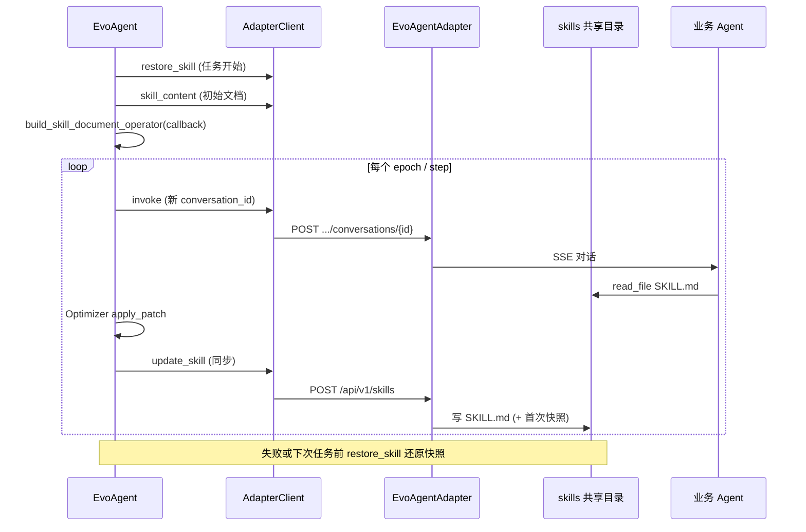

# Skill 热更新开发串讲文档

> 组织形式参考《AgentRule 与 Skill 解耦优化开发串讲文档》。内容来源：EvoAgent 优化链路、`adapter-api-contract.md`、`EvoAgentAdapter` SkillStore 设计及 `tests/skill_hotupdate` 验证脚本。
>
> 目标对象：**EvoAgent**（优化侧） + **EvoAgentAdapter**（Sidecar） + **业务 Agent**（如 EDPAgent / `edp_agent`）

---

## 1. 背景与目标

### 背景

- **当前问题**：EvoAgent 执行 Skill 文档优化（多 epoch 反思、patch 应用、验证门控）时，需要反复修改业务 Agent 正在使用的 Skill 正文；若每次修改都重启业务进程，优化周期不可接受且会打断在线对话。
- **影响范围**：所有通过 Adapter 接入 EvoAgent 优化的业务 Agent（本期以 `edp_agent` 理财场景为验证对象）。
- **解决思路**：EvoAgent 通过 Adapter 的 `update_skill` 写共享 `SKILL.md`；业务 Agent 在对话中 `read_file` 读取磁盘内容，**无需重启**即可生效正文变更。
- **需求来源**：EvoAgent Skill 优化 Pipeline 与 EvoAgentAdapter 解耦部署。

### 目标

- **目标 1**：优化过程中每轮 Skill 变更**实时推送**到业务 Agent 可读路径，**无需重启**业务 Agent。
- **目标 2**：Adapter 提供 `skill_list` / `skill_content` / `update_skill` / `restore_skill`，对 EvoAgent **1:N** 管理多业务 Agent。
- **目标 3**：首次热更前自动**快照**，支持任务开始前或失败时**幂等** `restore_skill`。
- **目标 4**：EvoAgent 优化**保留 YAML frontmatter**，仅修改 Markdown 正文。
- **目标 5**：验证 rollout 使用**唯一 conversation_id**，避免 checkpoint 缓存旧 Skill。

### 非目标

- 不通过热更修改 frontmatter 的运行时语义（须重启业务 Agent）。
- 优化正常结束时不自动 restore（最优 Skill 保留磁盘）。
- 不覆盖 EvoAgent Studio 前端 SSE 细节（仅保证 Adapter 契约稳定）。

---

## 2. 场景、规则与约束

### 核心场景

| 场景 | 触发条件 | 预期结果 |
| --- | --- | --- |
| 优化前恢复 | `run_optimization` 启动 | `restore_skill` 将上次实验残留还原（无快照则跳过失败项） |
| 读取初始 Skill | 构建 Operator 前 | `skill_content` 拉取磁盘当前版本作为优化基线 |
| Step 级热更 | Optimizer 应用 patch 后 | `update_skill` 写盘；下次 rollout `read_file` 读到新正文 |
| 验证 rollout | `EvoTrainer.evaluate` / 场景 Optimizer `_rollout` | 新 `conversation_id` 对话成功；traces 含 SKILL |
| 门控切换候选 | `apply_updates` / `load_state` | 同步 `update_skill`，验证集读到对应候选版本 |
| 优化失败/任务前清理 | 手动或任务开始 `restore_skill` | 还原到**首次** `update_skill` 前快照 |
| E2E 可观测验证 | 正文注入「首行标记」规约 | 用户可见回复首行体现热更内容（见 `run_e2e_experiment.py`） |

### 关键规则

| 规则 | 说明 |
| --- | --- |
| 写盘即生效 | 业务 Agent 对话中通过 `read_file` 读 `SKILL.md`，不缓存全文到进程内存 |
| 首次 update 建快照 | `.meta/{skill_name}.snapshot` 保存首次热更前内容；后续 update 不覆盖 |
| restore 幂等 | 多次 `restore_skill` 结果相同；快照文件不删除 |
| 同步 HTTP 热更 | `update_skill` 必须用同步 `httpx.Client`（Operator callback 链为同步） |
| frontmatter 保留 | `FrontmatterPreservingSkillDocumentOperator` 优化 body、回写 full document |
| 新 conv_id | 格式 `{run_id}:{phase}:{counter}:{case_id}`，禁止热更后复用旧会话 |

### 关键约束

| 约束 | 说明 | 影响 |
| --- | --- | --- |
| 共享文件系统 | Adapter 与业务 Agent 须同一 `skills_dir` | 部署必须对齐路径 |
| frontmatter 冷更新 | `register_skill()` 仅启动时执行 | 热更不改 frontmatter 语义 |
| checkpoint | 同 `conversation_id` 恢复历史 tool 结果 | 验证必须新 conv_id |
| answer 可能为空 | Adapter 代理有时不在 body 返回 `answer` | 评估/实验应读 traces `GENERATION` |

### 待确认点

| 问题 | 影响 | 当前处理 |
| --- | --- | --- |
| 优化结束后是否自动 restore | 磁盘上是否保留最优 Skill | 当前**不**自动 restore；任务开始 restore 做幂等清理 |
| 多 Skill 并行热更 | 多 operator 同时 `update_skill` | 已支持；`edp_agent` 理财 4 Skill 同目录 |
| Studio 展示热更事件 | 前端是否展示 `phase=apply` | 场景 Optimizer 已推 SSE log 事件 |

---

## 3. 总体方案

### 方案概述

1. **入口**：evoagent-studio / CLI 调用 EvoAgent `POST /optimize` → `run_optimization()`。
2. **准备**：`AdapterClient.restore_skill` → 对每个 skill `skill_content` → `build_skill_document_operator`（绑定 `update_skill` 回调）。
3. **训练循环**：`Trainer.train` → forward（RemoteAgent.invoke 经 Adapter 调业务 Agent）→ backward（LLM patch）→ **`_sync_skill_to_operator` → `update_skill`** → val 评估。
4. **落盘**：Adapter `SkillStore` 原子写 `{skills_dir}/{skill_name}/SKILL.md`。
5. **消费**：业务 Agent 下一轮对话 `read_file` 读取更新后正文。

### 链路图



### 模块分工

| 模块 | 职责 | 输入 | 输出 |
| --- | --- | --- | --- |
| `evo_agent.optimizer_runner` | 优化任务编排；restore / 构建 operators / 启动 Trainer | `OptimizeRequest` | `OptimizeReport` |
| `evo_agent.adapter_client.client` | HTTP 通信；Skill 四接口 + 对话 + traces | adapter_url, agent_name | JSON 响应 |
| `evo_agent.adapter_client.operator` | Operator 工厂；`on_parameter_updated` → `update_skill` | skill_content, AdapterClient | `SkillDocumentOperator` |
| `evo_agent.adapter_client.remote_agent` | Trainer 侧 Agent 代理；invoke 走 Adapter | case inputs | answer / events |
| `evo_agent.trainer.EvoTrainer` | 侧车 evaluate；门控候选 load_state 触发热更 | val_cases | score + trajectories |
| `agent_adapter.skill_store` | 文件系统 Skill 读写、快照、restore | agent_name, skill_name, content | SKILL.md + `.meta/` |
| 业务 Agent（如 EDPAgent） | 业务对话；运行时 `read_file` 加载 Skill 正文 | 用户 query | 回复 + traces |

---

## 4. 关键设计

| 设计点 | 处理方式 | 异常/边界 |
| --- | --- | --- |
| **热更触发** | `SkillDocumentOperator.set_parameter` / `load_state` → `on_parameter_updated` → `AdapterClient.update_skill` | `success=false` 抛 `AdapterError` 中断优化 |
| **frontmatter** | 优化器只改 body；回写时 `_assemble` 拼回 YAML 头 | 无 frontmatter 时直接写 body |
| **快照** | `_ensure_snapshot`：快照已存在则跳过 | restore 无快照 → `success=false` + message |
| **原子写** | `.SKILL.md.{pid}.tmp` + `os.replace` | 写失败清理 tmp |
| **同步客户端** | `AdapterClient` 独立 `_sync_http` 供 callback 使用 | async client 延迟创建，避免跨 event loop |
| **对话 ID** | `ConversationIdFactory.new(phase, case_id)` | 同 conv 复用 → 可能旧 Skill |
| **轨迹评估** | `get_traces` + retry；注入 evaluator | traces 缺失 → `TrajectoryUnavailableError` |
| **任务前 restore** | `run_optimization` 开头 best-effort restore | 失败仅 warning，继续当前磁盘状态 |

### Adapter Skill API

统一入口：**POST** `/api/v1/skills`（`agent_name` 在 body 中）

| action | 用途 | EvoAgent 调用方 |
| --- | --- | --- |
| `skill_list` | 列举 Skill 名称 | 探测 / e2e |
| `skill_content` | 读取全文 | `run_optimization` 构建 operator |
| `update_skill` | 热更写盘 | Operator callback / Optimizer sync |
| `restore_skill` | 批量还原快照 | 任务开始前 / 失败清理 |

对话与轨迹：

| 方法 | 路径 | 用途 |
| --- | --- | --- |
| POST | `/api/v1/agents/{agent_name}/conversations/{conversation_id}` | 触发业务 Agent 对话 |
| GET | `/api/v1/agents/{agent_name}/traces/{conversation_id}` | 原始轨迹 |
| GET | `/api/v1/agents/{agent_name}/cleaned-traces/{conversation_id}` | 清洗轨迹（EvoTrainer 评估用） |

### Skill 目录布局

```
{skills_dir}/{agent_name}/
├── {skill_name}/SKILL.md
└── .meta/
    ├── {skill_name}.json      # revision + updated_at
    └── {skill_name}.snapshot  # 首次 update 前全文
```

### 配置说明

| 配置项 | 所在位置 | 说明 |
| --- | --- | --- |
| `agents[].name` | Adapter `config.toml` | 如 `edp_agent` |
| `agents[].skills_dir` | Adapter 配置 | 默认 `{skills_root}/{name}`；须与业务 Agent 共享 |
| `agents[].agent_url` | Adapter 配置 | 业务 Agent 北向地址（如 `:18090`） |
| `adapter_url` | EvoAgent `OptimizeRequest` | Adapter 基址 |
| `skills` | `OptimizeRequest` | 待优化 skill 名列表 |
| `ADAPTER_URL` / `--base-url` | 验证脚本 `config.py` | 集成/E2E 脚本环境变量 |
| `ADAPTER_AGENT_NAME` / `--agent-name` | 验证脚本 | 目标 Agent |
| `ADAPTER_SKILL_NAME` / `--skill-name` | 验证脚本 | 待测 Skill |

### 灰度 / 回滚

| 维度 | 操作 |
| --- | --- |
| 单次实验回滚 | `restore_skill` 还原到首次 update 前 |
| Adapter 回滚 | 停止写入；从 snapshot 手工恢复 |
| EvoAgent 回滚 | 不调用 `update_skill`；仅本地 artifact 不影响磁盘 |
| 生产保留最优 | 优化成功后**不** restore；由发布流程接管 Skill 版本 |

---

## 5. 可观测性

### 观测点

| 观测点 | 日志/接口 | 用途 |
| --- | --- | --- |
| Skill 写盘 | Adapter structlog `skill_updated`（含 revision SHA256） | 确认热更落盘 |
| Skill 恢复 | `skill_restored` | 确认 restore 成功 |
| 优化阶段 | SSE `phase=restore_skill / setup / apply` | Studio 进度 |
| 对话成功 | invoke 响应 `success` | rollout 是否完成 |
| 轨迹 SKILL | traces `type=SKILL` | 是否执行目标 skill |
| 最终回复 | traces `GENERATION.output.content` | 热更内容是否体现在输出 |
| 快照存在 | 文件 `.meta/{skill}.snapshot` | 是否可 restore |

### 联调验证结论

| 验证项 | 远程集成/E2E | 本地单元 |
| --- | --- | --- |
| `update_skill` + 读回 | PASS（2026-06-18） | PASS（`TestUpdateSkill` ×5） |
| `skill_list` / `skill_content` | PASS | PASS（`TestSkillOperations` ×2） |
| 新会话对话 | PASS | PASS（`TestInvoke` ×7） |
| 回复首行热更标记 | PASS | — |
| `restore` 与原始一致 | PASS | — |
| Operator callback → `update_skill` | — | PASS（`test_operator_factory` ×9） |
| **合计** | **14/14** | **28/28** |

详见 `docs/Skill热更新测试用例执行报告.md`。

---

## 6. 测试建议

### 测试资产（本仓库）

```
tests/skill_hotupdate/
├── scripts/run_api_suite.py      # TC-01~12
├── scripts/run_e2e_experiment.py # TC-13~14
├── scripts/config.py             # ADAPTER_URL 等
└── docs/                         # 用例、报告、本文档
```

### 环境要求

**集成/E2E**：Python 3.10+；运行中的 Adapter + 已配置 `agent_url` 的业务 Agent；共享 `skills_dir`。

**EvoAgent 单元（可选）**：Python ≥ 3.12；pytest ≥ 8.0；editable 安装与源码匹配的 `agent-core` 与 `EvoAgent[dev]`。

### 建议测试重点与开发自测门禁

| 前置/触发条件 | 建议测试重点 | 希望保证的结果 | 优先级 | 测试方式 | 自测门禁 |
| --- | --- | --- | --- | --- | --- |
| Adapter + 业务 Agent 同机部署 | `skill_list` / `skill_content` | 能读到目标 Skill 列表 | P0 | 集成 | 是 |
| 任意 Skill 正文修改 | `update_skill` + 读回 | 磁盘与 API 一致 | P0 | 集成 | 是 |
| 热更后新 conv 对话 | invoke + traces | `success=true`；SKILL 记录存在 | P0 | E2E | 是 |
| 注入首行标记规约 | 用户可见输出 | 首行为热更标记 | P0 | E2E | 是 |
| 不存在 skill / agent | 错误码 | 404 + 明确 message | P0 | 集成 | 是 |
| restore 后全文 | byte-level 比较 | 与优化前一致 | P0 | E2E | 是 |
| 复用 conv_id | checkpoint 行为 | 文档化约束；EvoAgent 必须新 ID | P1 | 手工 | 否 |
| Operator 单测 | callback → update_skill | Mock 断言请求体 | P0 | 单元 | 是 |
| 完整 optimize 任务 | run_optimization | artifact + 磁盘最终 Skill | P1 | E2E | 否 |
| AdapterClient 单元 | pytest | 28 项全通过 | P0 | 单元 | 是 |

### 关键异常与边界

- **answer 为空**：从 traces 取 `GENERATION`；Studio 预览需对齐。
- **frontmatter 误改**：Optimizer 必须走 `FrontmatterPreservingSkillDocumentOperator`。
- **快照缺失 restore**：返回「未找到快照」；任务开始前 restore 对未改 skill 可忽略。
- **并发 update 同一 skill**：依赖文件原子 replace；避免多进程同时写同一 skill。
- **优化中断**：磁盘可能留中间版本；下次任务 `restore_skill` 清理。

### 执行示例

```bash
cd tests/skill_hotupdate/scripts
python run_api_suite.py --base-url http://127.0.0.1:8900 --agent-name edp_agent
python run_e2e_experiment.py --base-url http://127.0.0.1:8900
```

---

## 附录

### A. 代码锚点

| 环节 | 路径（monorepo 内） |
| --- | --- |
| 优化编排 | `EvoAgent/src/evo_agent/optimizer_runner.py` |
| HTTP 客户端 | `EvoAgent/src/evo_agent/adapter_client/client.py` |
| Operator 回调 | `EvoAgent/src/evo_agent/adapter_client/operator.py` |
| 远程 Agent | `EvoAgent/src/evo_agent/adapter_client/remote_agent.py` |
| 侧车 Trainer | `EvoAgent/src/evo_agent/trainer.py` |
| EDP 场景 Optimizer | `EvoAgent/scenarios/edp_agent/optimizer.py` |
| Skill 存储 | `EvoAgentAdapter/src/agent_adapter/skill_store.py` |
| Skill 路由 | `EvoAgentAdapter/src/agent_adapter/api/routes.py` |
| 存储设计 | `EvoAgentAdapter/docs/skills-storage-design.md` |
| API 契约 | `EvoAgent/docs/api/adapter-api-contract.md` |

### B. 测试资产与文档

| 文件 | 说明 |
| --- | --- |
| `tests/skill_hotupdate/scripts/run_api_suite.py` | 12 项远程 API 集成套件 |
| `tests/skill_hotupdate/scripts/run_e2e_experiment.py` | E2E 注入标记 + 对话 + restore |
| `tests/skill_hotupdate/scripts/config.py` | `ADAPTER_URL` 等环境变量 |
| `tests/skill_hotupdate/docs/Skill热更新测试用例.md` | 完整测试用例 |
| `tests/skill_hotupdate/docs/Skill热更新测试用例执行报告.md` | 执行报告 |
| `community/EvoAgent/tests/unit/test_adapter_client.py` | AdapterClient 单元（19 项） |
| `community/EvoAgent/tests/unit/test_operator_factory.py` | Operator 工厂单元（9 项） |

**单元测试一键执行**：

```bash
pip install -e path/to/agent-core
pip install -e path/to/community/EvoAgent[dev]
cd path/to/community/EvoAgent
python -m pytest tests/unit/test_adapter_client.py tests/unit/test_operator_factory.py -v
```

---

**文档版本**：v2（仓库内 `tests/skill_hotupdate/docs`，合并桌面版深度内容）  
**维护**：随 Adapter Skill API 与验证脚本演进更新
