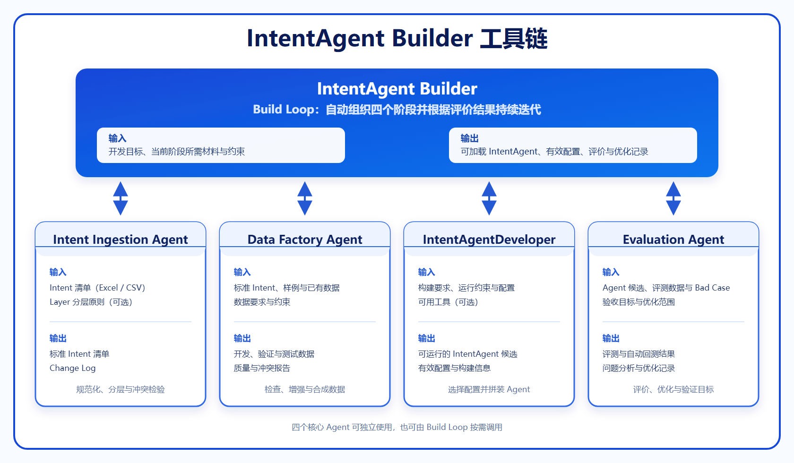

# IntentAgent Builder

## 1. 背景与问题

IntentAgent 负责理解用户表达并判断其真实意图，是智能应用正确响应用户需求的关键。它的准确性和稳定性会直接影响后续处理效果与用户体验。

在实际建设过程中，IntentAgent 主要面临以下问题：

- 意图体系梳理困难。原始需求通常分散在自然语言、业务材料和历史意图表中，意图边界容易重叠、遗漏或冲突；
- 不同业务场景对意图数量、层级、粒度和识别能力有不同要求，难以使用一套固定方案覆盖不同复杂度的需求；
- 复杂意图仍然难以处理，尤其是包含多个目标、边界相近或需要结合上下文判断的用户表达；
- 高质量数据在实际场景中较为缺乏，具有代表性的正常样例、边界样例和冲突样例往往需要额外整理或构造；
- 评测、问题分析、优化和回溯相对割裂，需要人工在多个环节之间协调，难以形成连续的迭代闭环。

## 2. 建设目标

IntentAgent Builder 是一套用于构建 IntentAgent 的 Agent 工具链。它能够根据不同业务场景的意图体系、数据条件和复杂度要求，组织意图定义、数据准备、Agent 构建、评价与优化，最终交付满足场景需求的 IntentAgent。

该工具链通过统一的构建与优化过程：

- 将用户提供的意图材料转化为边界清晰、可以验证的意图定义；
- 准备满足开发和评测要求的数据，并控制数据质量和冲突；
- 降低 IntentAgent 配置、组装和调试的专业门槛；
- 自动完成评测、问题分析、优化和回测。

## 3. 设计思路

### 3.1 IntentAgent 开发范式

IntentAgent Builder 将 IntentAgent 的开发过程归纳为四个阶段：

1. **定义意图**：梳理意图、优化描述、划分层级并消除冲突；
2. **准备数据**：检查已有数据，并按场景需要增强或合成开发与评测数据；
3. **构建 Agent**：选择适合当前场景的配置，构建可运行的 IntentAgent；
4. **评价与优化**：执行评测、分析问题、提出优化并自动回测。

不同场景可以调整各阶段的策略、配置和迭代次数。每个阶段均有明确的输入和输出，使开发过程可以复用、评价和追溯。

### 3.2 四个核心 Agent

工具链为四个开发阶段分别设计了一个可独立使用和扩展的核心 Agent：

- **Intent Ingestion Agent**：负责定义意图；
- **Data Factory Agent**：负责准备数据；
- **IntentAgentDeveloper**：负责配置和拼装可运行的 IntentAgent；
- **Evaluation Agent**：负责评价、优化和回测。

四个核心 Agent 分别完成一个阶段的专业任务，IntentAgent Builder 则将它们连接成完整流程。

### 3.3 IntentAgent Builder 与 Build Loop

IntentAgent Builder 负责组织完整开发流程。四个核心 Agent 均可独立接收用户输入并返回结果，也可以由 IntentAgent Builder 自动调用。

Builder 内部通过 `Build Loop()` 自动推进和迭代开发流程。它从当前阶段的最少必要信息开始，复用已有材料和阶段结果，并按需调用四个核心 Agent。当评价结果未达到目标时，Build Loop 会定位需要调整的阶段，完成优化后再次评价，直至满足要求或触发停止条件。只有缺少必要材料或业务语义必须由人判断时，才请求用户补充或裁决。

## 4. 架构设计

下图展示 IntentAgent Builder、四个核心 Agent，以及各模块最主要的输入和输出。完整的系统边界与模块协作关系见 [L0 总体架构](./architecture/L0-architecture.md)。

用户可以独立使用任一核心 Agent；需要完成整个开发过程时，也可以通过 IntentAgent Builder 的 `Build Loop()` 自动串联四个阶段。

### 4.1 IntentAgent Builder

- **输入**：包含名称和描述的 Intent 清单、Layer 分层原则等起始材料，以及开发目标；数据、构建配置、验收目标和运行约束可在对应阶段渐进补充；
- **输出**：满足验收要求、可在本地保存和重新加载的 IntentAgent，以及实际生效的配置、评价结果和优化日志；未通过时返回明确的问题与建议；
- **职责**：通过 `Build Loop()` 复用已有信息、按需调用四个核心 Agent、传递阶段结果，并根据评价反馈自动调整相关阶段，完成从意图定义到评价优化的完整开发过程。

进一步了解内部结构、接口和模块协作方式，见 [IntentAgent Builder L1 架构](./architecture/builder/L1-architecture.md)。

### 4.2 Intent Ingestion Agent

- **用户输入**：包含 Intent 名称和描述的 Excel 或 CSV 清单；可选的 Layer 分层原则 Markdown（用于说明意图层级的划分方法）、运行配置和任务说明；
- **系统输出**：任务完成时返回标准 Intent 清单和 Change Log；迭代过程中返回冲突、影响范围、修改建议和待用户判断的问题；
- **职责**：规范化 Intent 名称和描述，构造层级关系，检验意图冲突，并通过多轮交互形成边界清晰的 Intent 体系。

进一步了解内部结构、输入输出格式、接口和模块协作方式，见 [Intent Ingestion L1 架构](./architecture/intent-ingestion/L1-architecture.md)。

### 4.3 Data Factory Agent

- **用户输入**：标准意图数据、用户样例、已有数据、FAQ 或知识内容，以及数据要求和约束；
- **系统输出**：经过校验的开发、验证和测试数据，以及数据质量与冲突报告；
- **职责**：检查已有数据，按场景需要补充、增强或合成数据，并执行质量校验和冲突检验。

进一步了解该模块的详细设计，见 [Data Factory L1 架构](./architecture/data-factory/L1-architecture.md)。

### 4.4 IntentAgentDeveloper

- **用户输入**：IntentAgent 构建要求、运行约束和构建配置，以及可选的可用工具；
- **系统输出**：可运行的 IntentAgent 候选、候选配置和构建信息；
- **职责**：根据场景要求选择和应用配置，拼装可供评价的 IntentAgent 候选。

进一步了解该模块的详细设计，见 [IntentAgentDeveloper L1 架构](./architecture/intent-agent-developer/L1-architecture.md)。

### 4.5 Evaluation Agent

- **用户输入**：IntentAgent 候选、评测数据、Bad Case、验收目标、允许优化的范围和停止条件；
- **系统输出**：评测结果、问题分析、优化记录、自动回测结果和目标达成判断；
- **职责**：自动执行评测，在允许范围内优化 IntentAgent，并通过回测判断是否达到目标。

进一步了解该模块的详细设计，见 [Evaluation L1 架构](./architecture/evaluation/L1-architecture.md)。

## 5. 特性说明文档导航

特性说明按版本维护，记录该版本新增或调整的能力、使用方式、限制和验证方法。

进入 [特性说明文档目录](./features/README.md)。

## 6. 部署说明文档导航

部署说明记录环境准备、配置、启动、健康检查、升级和回滚方式。

进入 [部署说明文档目录](./deployment/README.md)。
